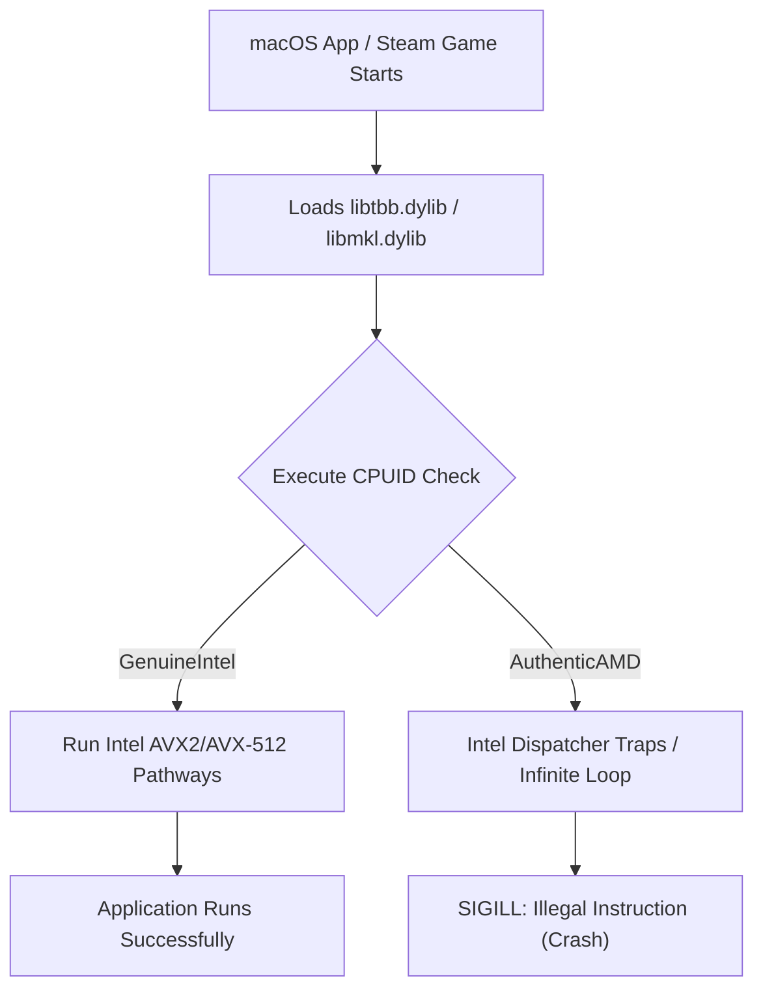
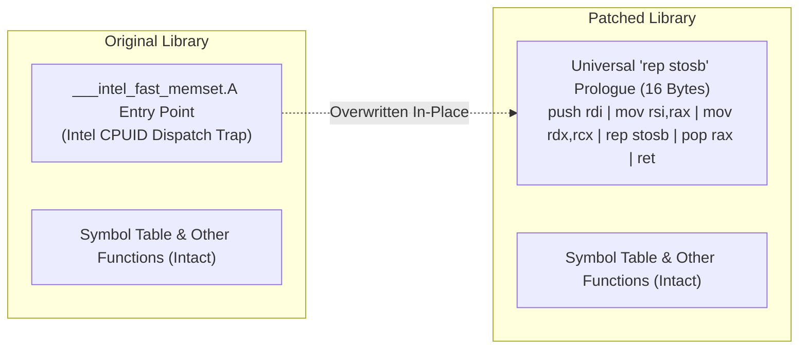
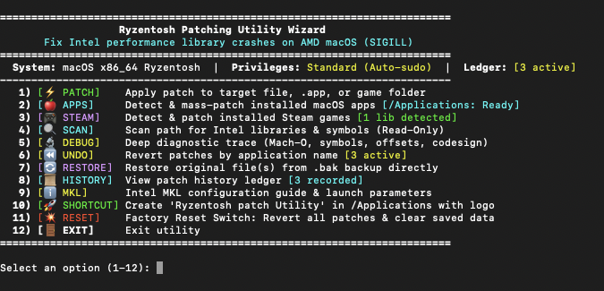

<p align="center">
  
</p>

<h2 align="center">🤖 Written with the Help of AI</h2>

<h1 align="center">Ryzentosh Patch Utility (RPA)</h1>

<p align="center">
  <b>Automated, in-place binary patcher and diagnostic suite for AMD Hackintoshes running macOS.</b><br>
  Fixes Intel performance library crashes (<code>SIGILL: Illegal Instruction</code>) across macOS applications and Steam games running on AMD Ryzen CPUs.
</p>

<p align="center">
  <a href="#features"></a>
  <a href="#features"></a>
  <a href="#prerequisites"></a>
  <a href="#testing"></a>
  <a href="#credits--open-source-acknowledgements"></a>
</p>

---

## TL;DR / Quick Start

Got an AMD Hackintosh (Ryzentosh) and your games or creative apps (*Hearts of Iron IV*, *Crusader Kings*, *DaVinci Resolve*, *Adobe Creative Cloud*, etc.) crash immediately on boot with `SIGILL: Illegal instruction`? 

**You don't need to disable libraries or give up on AMD macOS.** Just run:

```bash
# Clone the repo and run the interactive wizard
chmod +x patch.sh undo.sh
./patch.sh
```

Or download **`Ryzentosh-Patch-Utility.dmg`**, drag the `.app` into `/Applications`, and double-click it.

---

## Table of Contents

- [The Problem: Why Intel Libraries Crash on AMD Ryzen](#the-problem-why-intel-libraries-crash-on-amd-ryzen)
  - [The CPUID Check & Vector Dispatch Failure](#the-cpuid-check--vector-dispatch-failure)
  - [Why `brew install tbb` Alone Doesn't Work](#why-brew-install-tbb-alone-doesnt-work)
- [How It Works (Under the Hood)](#how-it-works-under-the-hood)
  - [1. In-Place Function Prologue Soft-Patching](#1-in-place-function-prologue-soft-patching)
  - [2. Dynamic Symbol Resolution & Fat-Binary Slice Realignment](#2-dynamic-symbol-resolution--fat-binary-slice-realignment)
  - [3. Gatekeeper Quarantine & Ad-Hoc Code Signing](#3-gatekeeper-quarantine--ad-hoc-code-signing)
  - [4. Persistent History Ledger & Update Healing](#4-persistent-history-ledger--update-healing)
  - [5. Persistent CLI Loop & Clean Redraws](#5-persistent-cli-loop--clean-redraws)
- [Prerequisites](#prerequisites)
- [Installation Guide](#installation-guide)
  - [Method 1: Apple Disk Image (DMG) - Recommended](#method-1-apple-disk-image-dmg---recommended)
  - [Method 2: Standalone macOS App ZIP](#method-2-standalone-macos-app-zip)
  - [Method 3: Terminal & Command-Line Launcher](#method-3-terminal--command-line-launcher)
- [Interactive Wizard Menu](#interactive-wizard-menu)
- [Command-Line Usage (Power Users & Scripts)](#command-line-usage-power-users--scripts)
  - [Direct Fast Patching](#direct-fast-patching)
  - [Mass Application Scanning & Patching](#mass-application-scanning--patching)
  - [Steam Games Integration](#steam-games-integration)
  - [Read-Only Diagnostics & Deep Debug Traces](#read-only-diagnostics--deep-debug-traces)
  - [Undo & Rollback Engine](#undo--rollback-engine)
  - [Factory Reset Switch](#factory-reset-switch)
- [Intel MKL Configuration Guide](#intel-mkl-configuration-guide)
- [Supported Libraries & Applications](#supported-libraries--applications)
- [Automated Verification & Testing](#automated-verification--testing)
- [Credits & Open Source Acknowledgements](#credits--open-source-acknowledgements)
- [Disclaimer & License](#disclaimer--license)

---

## The Problem: Why Intel Libraries Crash on AMD Ryzen

A lot of popular software on macOS is compiled using Intel's performance suites—most notably **Intel Threading Building Blocks (`libtbb.dylib`)**, **Intel Math Kernel Library (`libmkl*.dylib`)**, **Intel OpenMP (`libiomp5.dylib`)**, and **Intel IPP (`libipp*.dylib`)**.

### The CPUID Check & Vector Dispatch Failure

When these libraries start up, they query the CPU via the x86 `CPUID` instruction to decide which optimized AVX/SSE assembly path to execute:

1. On a real Mac with an Intel CPU, `CPUID` returns vendor string `"GenuineIntel"`. The library branches into optimized Intel vector code paths.
2. On an AMD Ryzentosh, `CPUID` returns `"AuthenticAMD"`.
3. Because Intel's proprietary dispatchers were never written to recognize or support non-Intel vendor strings in these routines, functions like `___intel_fast_memset.A`, `___intel_fast_memset.J`, or `___intel_fast_memcpy` either enter recursive infinite loops or attempt CPU instructions that fail with:
   ```plaintext
   EXC_CRASH (SIGILL: Code 4 Illegal instruction: 4)
   ```
4. macOS memory management (`libsystem_malloc`) or the kernel terminates the process immediately to prevent silent memory corruption.



### Why `brew install tbb` Alone Doesn't Work

A lot of devs first try swapping the broken `libtbb.dylib` with open-source TBB from Homebrew:

```bash
brew install tbb
cp $(brew --prefix tbb)/lib/libtbb.dylib /path/to/app/Contents/Frameworks/libtbb.dylib
```

While having `brew install tbb` installed is good practice for open-source CLI tools, **replacing the bundled library directly causes commercial apps and games to crash immediately**:

```plaintext
Termination Reason: Namespace DYLD, Code 4 Symbol missing
Symbol not found: __ZN3tbb4task13note_affinityEt
```

#### The ABI Breakdown
Homebrew ships modern **oneTBB** (v2021+). In oneTBB, Intel redesigned the API from the ground up and dropped legacy interfaces (such as `tbb::task`, `note_affinity`, and classic scheduler functions). Games and commercial apps (like *Hearts of Iron IV*, *Crusader Kings*, *DaVinci Resolve*, or *Adobe CC*) were linked against **classic TBB (v4 / v2019 / v2020)**. Swapping in Homebrew's binary breaks ABI backwards compatibility, causing macOS `dyld` (the dynamic linker) to halt the process on boot.

---

## How It Works (Under the Hood)

Instead of replacing the library and breaking symbols, **Ryzentosh Patch Utility** performs surgical **in-place function prologue soft-patching**: we leave the original vendor library, export tables, and all valid symbols 100% intact, overwriting *only* the entry point of the crashing Intel memset/memcpy dispatcher with a universal x86_64 machine code sequence.



### 1. In-Place Function Prologue Soft-Patching

Under the standard **System V AMD64 ABI** used by macOS:
- **`%rdi`**: Destination buffer pointer.
- **`%rsi`**: Fill byte / character value.
- **`%rdx`**: Byte count / length.
- **`%rax`**: Return register (must return the original destination pointer in `%rdi`).

We overwrite the entry point with an atomic 16-byte routine:

```assembly
push %rdi              ; Save destination buffer pointer onto stack (0x57)
mov  %rsi, %rax        ; Move fill character value to RAX / AL (0x48 0x89 0xF0)
mov  %rdx, %rcx        ; Move byte count to count register RCX (0x48 0x89 0xD1)
rep  stosb             ; Hardware fast fill: store byte AL into [RDI], repeated RCX times (0xF3 0xAA)
pop  %rax              ; Restore destination pointer from stack into return register RAX (0x58)
ret                    ; Return cleanly to caller (0xC3)
nop                    ; Alignment padding to 16 bytes (0x90 0x90 0x90 0x90 0x90)
```

**Machine Bytes (16 bytes):**
```hex
57 48 89 F0 48 89 D1 F3 AA 58 C3 90 90 90 90 90
```

`rep stosb` is a hardware microcode string instruction implemented on every x86 CPU since the 80386. It runs at full native hardware speed on AMD Ryzen without triggering CPUID checks, vector dispatch bugs, or illegal instruction exceptions.

### 2. Dynamic Symbol Resolution & Fat-Binary Slice Realignment

- **No Hardcoded Offsets**: The utility queries the Mach-O symbol table with `nm` to extract the virtual memory address of target symbols (`___intel_fast_memset`, `___intel_fast_memset.A`, `__intel_fast_memset.J`, etc.) and calculates the physical file offset within the `__TEXT,__text` segment.
- **Universal / Fat-Binary Slices**: In universal binaries containing both 32-bit (`i386`) and 64-bit (`x86_64`) slices, we parse the Mach-O fat headers to locate the 64-bit architecture slice and resolve offsets relative to it.
- **Codesign Realignment Resilience**: When macOS `codesign` signs a binary, it can shift universal binary slices from 4 KB boundaries (`0x3a000`) to 16 KB page boundaries (`0x44000`). The utility automatically detects slice shifts and auto-syncs history records so you never get stuck in a re-prompt loop.

### 3. Gatekeeper Quarantine & Ad-Hoc Code Signing

Modifying bytes on disk invalidates existing code signatures:
1. **Quarantine Stripping**: Runs `xattr -cr` to remove `com.apple.quarantine` attributes.
2. **Ad-Hoc Signing**: Re-signs the binary with `codesign --force --deep -s -` so macOS `amfi` (Apple Mobile File Integrity) and `dyld` load the patched file without triggering a `SIGKILL`.

### 4. Persistent History Ledger & Update Healing

- Tracks all patches in:
  `~/Library/Application Support/RyzentoshPatchUtility/patch_history.json`
- Stores application names, target file paths, original byte sequences, and timestamps.
- **Update Detection**: When Steam or an application update overwrites a patched library with an unpatched binary, the utility detects it on launch and prompts you to repatch with one keystroke.

### 5. Persistent CLI Loop & Clean Redraws

- The utility runs continuously in a clean menu loop that **only exits when Option 12 (`Exit`) is selected**.
- Sudo actions run via child subprocesses instead of `os.execvp`, returning you straight back to the wizard when done.
- Screen redraw engine uses ANSI clear and scrollback buffer wipe (``), keeping the terminal completely clean between actions.

---

## Prerequisites

Make sure your machine has:

1. **Operating System**: macOS High Sierra (10.13) through macOS Sonoma (14.x) / Sequoia (15.x).
2. **Hardware**: AMD Hackintosh (Ryzentosh) running AMD Ryzen (1000 through 9000 series), Ryzen Threadripper, or AMD EPYC.
3. **Xcode Command Line Tools** (for `codesign`, `otool`, `nm`, `sips`, and `iconutil`):
   ```bash
   xcode-select --install
   ```
4. **Python 3.8+**: Built-in on macOS or installed via Homebrew:
   ```bash
   python3 --version
   ```
5. **Homebrew & Open-Source TBB**:
   While Homebrew's modern oneTBB cannot replace legacy bundled libraries due to ABI symbol differences, having Homebrew and TBB installed is strongly recommended. It provides modern development runtimes and AMD-compatible threading tools:
   ```bash
   # Install Homebrew (if you haven't already)
   /bin/bash -c "$(curl -fsSL https://raw.githubusercontent.com/Homebrew/install/HEAD/install.sh)"

   # Install open-source TBB runtime
   brew install tbb
   ```

---

## Installation Guide

### Method 1: Apple Disk Image (DMG) - Recommended

1. Open **`Ryzentosh-Patch-Utility.dmg`**.
2. Drag **`Ryzentosh Patch Utility.app`** into the `/Applications` shortcut.
3. Eject the DMG.
4. Launch **Ryzentosh Patch Utility** from Launchpad, Finder, or Spotlight (`Cmd + Space`).

> [!NOTE]
> Double-clicking the `.app` bundle opens a dedicated Terminal session running the interactive wizard.

---

### Method 2: Standalone macOS App ZIP

1. Extract **`Ryzentosh-Patch-Utility-App.zip`**.
2. Move **`Ryzentosh Patch Utility.app`** into your `/Applications` folder.
3. Launch from Finder or Spotlight.

---

### Method 3: Terminal & Command-Line Launcher

If you prefer working from source in the terminal:

```bash
# Make scripts executable
chmod +x patch.sh undo.sh build_app.py

# Launch interactive wizard
./patch.sh

# (Optional) Create /Applications app shortcut with retina icon
./patch.sh create-alias
```

---

## Interactive Wizard Menu

When you launch `./patch.sh` or double-click the `.app` bundle, the interactive terminal wizard is displayed:

<p align="center">
  
</p>

- **Clean Redraws**: Every choice immediately clears the terminal screen so you see only the active task without leftover scrollback artifacts.
- **Persistent Session**: After each task finishes, you can review output and press Enter to return to the main menu.
- **Exit Only From Main Menu**: The utility runs continuously; selecting **Option 12** (or typing `q`, `exit`) cleanly exits the application.

<details>
<summary><b>Click to expand text-based menu overview</b></summary>

```text
========================================================================
                   Ryzentosh Patching Utility Wizard                    
       Fix Intel performance library crashes on AMD macOS (SIGILL)      
========================================================================
  System: macOS x86_64 Ryzentosh  |  Privileges: Standard (Auto-sudo)  |  Ledger: [3 active]
------------------------------------------------------------------------
   1) [⚡ PATCH]    Apply patch to target file, .app, or game folder
   2) [🍎 APPS]     Detect & mass-patch installed macOS apps [/Applications: Ready]
   3) [🎮 STEAM]    Detect & patch installed Steam games [1 lib detected]
   4) [🔍 SCAN]     Scan path for Intel libraries & symbols (Read-Only)
   5) [🔬 DEBUG]    Deep diagnostic trace (Mach-O, symbols, offsets, codesign)
   6) [⏪ UNDO]     Revert patches by application name [3 active]
   7) [🔄 RESTORE]  Restore original file(s) from .bak backup directly
   8) [📜 HISTORY]  View patch history ledger [3 recorded]
   9) [ℹ️  MKL]      Intel MKL configuration guide & launch parameters
  10) [🚀 SHORTCUT] Create 'Ryzentosh patch Utility' in /Applications with logo
  11) [💥 RESET]    Factory Reset Switch: Revert all patches & clear saved data
  12) [🚪 EXIT]     Exit utility
========================================================================

Select an option (1-12): 
```

</details>

---

## Command-Line Usage (Power Users & Scripts)

For scripts, CI, or power users who prefer CLI flags over the menu:

### Direct Fast Patching

Bypasses directory scanning and patches targets directly in under 10 milliseconds:

```bash
# Direct patch by application name
./patch.sh --app "DaVinci Resolve" --patch
./patch.sh --app "Hearts of Iron IV" --patch

# Direct patch by custom path (file, folder, or .app)
./patch.sh patch "/Applications/Hearts of Iron IV/Hearts of Iron IV.app"
./patch.sh patch "/path/to/libtbb.dylib"

# Dry-run mode (simulates patch without writing bytes)
./patch.sh patch "/Applications/Target.app" --dry-run
```

---

### Mass Application Scanning & Patching

Inspects all applications in `/Applications` and `~/Applications` with an animated loading bar:

```bash
# Scan installed macOS applications for Intel libraries (Read-Only)
./patch.sh apps

# Interactive picker for detected applications
./patch.sh apps --patch

# Mass patch ALL detected macOS applications that need patching
./patch.sh apps --all --patch
```

---

### Steam Games Integration

Scans default and external Steam library folders defined in `libraryfolders.vdf`:

```bash
# List all detected Steam games and their patch status
./patch.sh steam

# Interactive picker for detected games
./patch.sh steam --patch

# Directly target and patch a specific Steam game by name
./patch.sh steam --game "Crusader Kings II" --patch

# Mass patch ALL detected Steam games needing patch
./patch.sh steam --all --patch
```

---

### Read-Only Diagnostics & Deep Debug Traces

Performs non-destructive static analysis:

```bash
# Safe scan of any directory or .app
./patch.sh scan "/Applications/Game.app"

# Deep diagnostic trace (Mach-O headers, segments, offsets, symbols, signatures)
./patch.sh debug "Hearts of Iron IV"
./patch.sh debug "/path/to/libtbb.dylib"
```

---

### Undo & Rollback Engine

Revert patches safely using the recorded ledger:

```bash
# Launch interactive undo menu
./undo.sh

# Undo patches for a specific application by name
./undo.sh "Hearts of Iron IV"
./undo.sh "DaVinci Resolve"

# Undo all active patches across the entire system
./undo.sh --all

# View detailed patch history and timestamps
./undo.sh --list
```

---

### Factory Reset Switch

Reverts all patches, cleans up leftover `.bak` backup files, and wipes the history ledger:

```bash
# Interactive confirmation prompt
./patch.sh reset

# Non-interactive forced reset (automation / clean state)
./patch.sh reset -f
```

---

## Intel MKL Configuration Guide

For applications or games using **Intel Math Kernel Library (MKL)**, runtime CPUID checks can be overridden using an environment variable without modifying binary files:

### Steam Launch Options
1. Open **Steam** $
ightarrow$ Right-click your game $
ightarrow$ **Properties...**
2. In the **General** tab under **Launch Options**, paste:
   ```bash
   /usr/bin/env MKL_DEBUG_CPU_TYPE=5 %command%
   ```

### Terminal Execution
Export the variable in your shell prior to executing your binary:
```bash
export MKL_DEBUG_CPU_TYPE=5
./YourApplication.app/Contents/MacOS/YourApplication
```

> [!TIP]
> `MKL_DEBUG_CPU_TYPE=5` instructs the Intel MKL dispatcher to route operations through optimized AVX2 routines regardless of whether the processor is Intel or AMD.

---

## Supported Libraries & Applications

### Covered Library Families

| Library Family | Binary Names / Patterns | Typical Crash Symptoms |
| :--- | :--- | :--- |
| **Intel TBB** | `libtbb.dylib`, `libtbbmalloc.dylib`, `tbb.framework` | `SIGILL in ___intel_fast_memset.A` |
| **Intel MKL** | `libmkl_rt.dylib`, `libmkl_core.dylib`, `mkl.framework` | `Cannot load ... or illegal instruction` |
| **Intel OpenMP** | `libiomp5.dylib`, `libomp.dylib`, `libopenmp.dylib` | `OMP: Error #179: Function failed` |
| **Intel IPP** | `libippcore.dylib`, `libipps.dylib`, `ipp.framework` | `Illegal instruction: 4` on startup |
| **Intel Compiler Runtimes** | `libimf.dylib`, `libsvml.dylib`, `libirng.dylib` | Math and vector runtime failures |
| **Intel Ray Tracing & AI** | `libembree*.dylib`, `liboidn*.dylib`, `libospray*.dylib` | Rendering worker crash |
| **Video Codecs** | `libSvtAv1Enc.dylib`, `libmainconcept*.dylib` | Encoding / transcoding pipeline abort |
| **Creative Plugins** | `MMXCore.plugin`, `FastCore.bundle`, `TextModel.framework` | Photoshop / Premiere startup crash |

### Verified Software & Games
- **Paradox Interactive Games**: *Hearts of Iron IV*, *Crusader Kings II / III*, *Stellaris*, *Europa Universalis IV*, *Victoria 3*
- **Simulation & Strategy**: *Cities: Skylines*, *Civilization VI*, *Total War series*
- **Creative & Professional Tools**: *Blackmagic DaVinci Resolve*, *Adobe Creative Cloud* plugins, *Blender* Intel render backends, *Audacity* Intel plugins

---

## Automated Verification & Testing

The repository includes an automated test suite covering:
- Assembly payload byte length and System V AMD64 alignment.
- Mach-O 32-bit and 64-bit fat-header inspection.
- Clang shared library generation and dynamic symbol patch verification.
- Universal binary slice realignment resilience.
- Factory reset switch and ledger wipe verification.
- Continuous interactive wizard loop and screen clear execution.

Run the test suite locally:
```bash
python3 -m unittest discover tests -v
```

Output:
```text
Ran 20 tests in ~3s
OK
```

---

## Credits & Open Source Acknowledgements

This utility builds upon the collective engineering, research, and tools developed by the open-source and Hackintosh communities:

- **[AMD-OSX Community](https://amd-osx.com/) & [Acidanthera](https://github.com/acidanthera)**:
  For developing OpenCore, kernel-level AMD vanilla patches, and pioneering research into macOS compatibility on AMD processors.
- **[oneAPI / Intel oneTBB](https://github.com/oneapi-src/oneTBB)**:
  For open-sourcing the Threading Building Blocks specification and modern runtime libraries.
- **Intel MKL Research Pioneers**:
  For documenting the `MKL_DEBUG_CPU_TYPE=5` CPUID bypass flag that enables AVX2 execution on non-Intel processors.
- **[Homebrew](https://brew.sh/)**:
  The indispensable package manager for macOS, providing modern toolchains, LLVM, Clang, and `tbb`.
- **Apple Open Source**:
  For Darwin, Mach-O specifications, `cctools` (`nm`, `otool`), and `codesign` utilities.
- **[Python Software Foundation](https://www.python.org/)**:
  For Python 3, providing the cross-version standard library used for binary parsing and terminal automation.

---

## Disclaimer & License

- **License**: Released under the [MIT License](LICENSE).
- **Disclaimer**: This tool is an independent open-source utility designed for compatibility and interoperability research on AMD-based personal computers. macOS, Apple, and the Apple logo are registered trademarks of Apple Inc. Intel, Intel Core, and Intel TBB are trademarks of Intel Corporation. AMD and Ryzen are trademarks of Advanced Micro Devices, Inc. This project is not affiliated with, sponsored by, or endorsed by Apple Inc., Intel Corporation, or AMD Inc.
